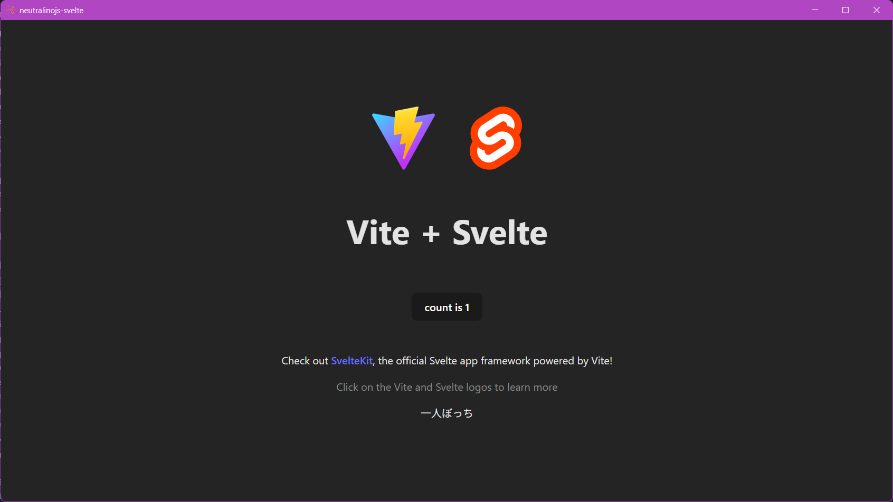

# Neutralinojs × Svelte 🦧

This is a simple [Neutralinojs](https://neutralino.js.org/) template that uses [Svelte](https://svelte.dev) and [Vite](https://vite.dev/).

## How to install

1. Execute this command: `neu create app_name --template amsyarzero/neutralinojs-svelte`
2. `cd` into `./app_name/svelte-app`
3. Run `npm install`

## How to use

- Configure aspects of Neutralinojs in `neutralino.config.json` e.g. initial window size, namespace permissions
- Add `.svelte` files inside `./neutralino-js/svelte-app/src`

## Useful commands

| Command     | Description                                  |
| ----------- | -------------------------------------------- |
| `neu run`   | Runs a preview of the app                    |
| `neu build` | Builds the app for Windows, macOS, and Linux |

To run with special arguments e.g. launching with element inspector, do:

- `neu run -- --<arguments>` on other terminals
- `neu run -- -- --<arguments>` on Powershell (thanks popoklopapa! 🙇🏽‍♂️)

List of valid arguments can be found [here](https://neutralino.js.org/docs/cli/internal-cli-arguments).

## Special thanks

- [Neutralinojs team](https://neutralino.js.org/docs/contributing/about-neutralinojs)
- Ori for her amazing [Neutralino Svelte template](https://github.com/origamingwastaken/neutralino-svelte). Without it, I wouldn't be able to learn and make this
- popoklopapa for the Powershell `neu run` fix, very much appreciated
